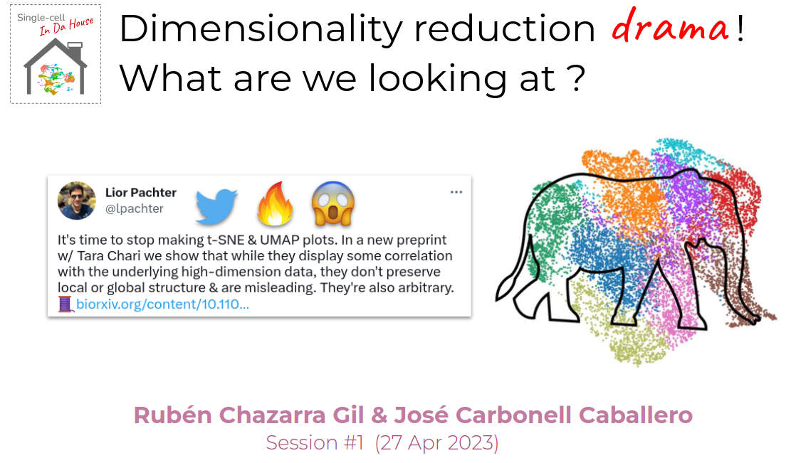

# Dimensionality-Reduction
## 2023-04 Single-cell in da House - Session 1

First session of the Single-cell in da House initiative at the [Life Sciences Department](https://www.bsc.es/discover-bsc/organisation/scientific-structure/life-sciences) of the [Barcelona Supercomputing Center](bsc.es/) which aims to bring the community working on single-cell omics at BSC together.

In this 1st session, we discussed about **dimensionality reduction**. 

Were in the single-cell data processing pipeline is Dimensionality Reduction applied ? What are the differences between linear  and non-linear dimensionality reduction methods ? Do these methods preserve local or global structure ? How does tSNE work ? 

These and more interesting questions are included in this session ! 

